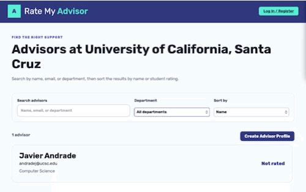

# Rate My Advisor

CodePath WEB103 Final Project

Designed and developed by: Kaylie Chang, Mohtashim Syed, Alex Gong, Justin Wong, Fiyinfoluwa Somorin, Isfahan Juboraj

🔗 Link to deployed app: https://server-bncl.onrender.com

## About

### Description and Purpose

Rate My Advisor is an app where students can find, review, and rate academic
advisors based on helpfulness, availability, communication, and overall
support.

### Inspiration

The project was inspired by personal experiences with academic advising. We
wanted students to have a place—similar to Rate My Professors—where they can
learn from one another before choosing an advisor.

## Tech Stack

Frontend:

- React
- React Router
- CSS
- JavaScript
- HTML

Backend:

- Express
- PostgreSQL (Render)
- Passport.js with local and GitHub authentication
- JavaScript

## Features

### (1) ✅ Browse list of advisors available to the specific university

The university page lists the available academic advisors and links each result
to its detailed profile.


### (2) ✅ User can click on advisor to see detailed information on the related content

Users can open an advisor profile to view university and department details,
the current average rating, student reviews, and recommendation percentage.


### (3) ✅ Allow users to add new advisors

Users can add a new advisor to a university through a form.



### (4) ✅ Users can create, edit, and delete their own advisor reviews

Users can rate an advisor across overall, communication, and availability
categories, explain their rating, and state whether they recommend the advisor.
Authenticated authors can edit or delete their own reviews.

Demo GIF still needs to be recorded.

### (5) Likes on Comments

Planned: authenticated users will be able to like and unlike reviews. The
implementation is currently in draft PR #34.

Demo GIF pending implementation.

### (6) Report Button

Planned: users will be able to persistently report inappropriate reviews. The
button on `main` currently shows a confirmation only; it does not save a report
to PostgreSQL or hide the review.

Demo GIF pending implementation.

### (7) ✅ Average grades are applied on advisors overall ratings for quick student viewing

Students can search for good advisors quickly by viewing the average grade given to each advisor based on their overall ratings (rounded to the nearest tenth place).


### (8) ✅ Search, filter, and sort advisors

Students can search for a university, then filter and sort the matching advisor
list without leaving the page.


### (9) Authentication and review ownership

The app supports local accounts, sessions stored in PostgreSQL, GitHub OAuth,
and owner-only review edits and deletions. Local authentication is implemented.
The deployed GitHub OAuth callback still needs to be corrected before this
feature is considered production-ready.

## Installation Instructions

Requirements:

- Node.js 20 or newer
- A PostgreSQL database

With Docker:

1. Create `server/.env` with the server and PostgreSQL settings:

   ```text
   PGUSER=your_user
   PGPASSWORD=your_password
   PGHOST=your_host
   PGPORT=5432
   PGDATABASE=your_database
   NODE_ENV=development
   PORT=3000
   CLIENT_URL="http://localhost:5173"
   SESSION_SECRET=super_secret_rate_my_advisor_key
   GITHUB_CLIENT_ID=your_client_id
   GITHUB_CLIENT_SECRET=your_client_secret
   GITHUB_CALLBACK_URL=your_callback_url
   ```

2. Run:

   ```bash
   docker compose up --build
   ```

Without Docker:

1. Install the frontend and server dependencies:

   ```bash
   cd client && npm ci
   cd ../server && npm ci
   ```

2. Create `server/.env` with the server and PostgreSQL settings:

   ```text
   PGUSER=your_user
   PGPASSWORD=your_password
   PGHOST=your_host
   PGPORT=5432
   PGDATABASE=your_database
   NODE_ENV=development
   PORT=3000
   CLIENT_URL="http://localhost:5173"
   SESSION_SECRET=super_secret_rate_my_advisor_key
   GITHUB_CLIENT_ID=your_client_id
   GITHUB_CLIENT_SECRET=your_client_secret
   GITHUB_CALLBACK_URL=your_callback_url
   ```

3. Create `client/.env` so the Vite development server can reach the API:

   ```text
   VITE_API_URL=http://localhost:3000
   ```

4. Create the database tables:

   ```bash
   cd server
   npm run reset
   ```

5. Start the API and frontend in separate terminals:

   ```bash
   cd server && npm run dev
   cd client && npm run dev
   ```

6. Open the local URL printed by Vite.

## Current Limitations

- The deployed GitHub OAuth flow redirects to the old auth preview callback and
  must be updated to use `https://server-bncl.onrender.com/auth/github/callback`.
- Persistent likes and reports are not on `main`; PRs #32 and #34 overlap and
  need to be reconciled.
- The final feature GIFs and complete walkthrough GIF still need to be recorded.

## Attributions & Data Credits

- **US Universities Data**: Sourced from the open-source [Hipo/university-domains-list](https://github.com/Hipo/university-domains-list) repository under the MIT License.