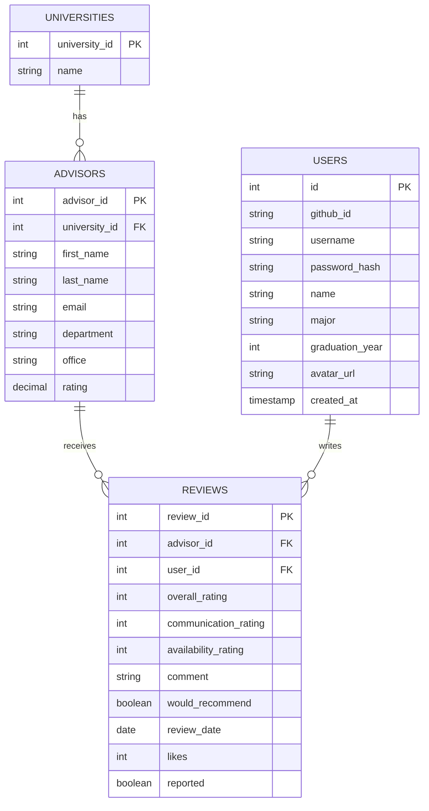

# Entity Relationship Diagram

## Tables

- **users** — Registered user accounts (local or GitHub OAuth)
- **universities** — Universities that advisors belong to
- **advisors** — Academic advisors who can be reviewed
- **reviews** — Reviews written by users for advisors

## Entity Relationship Diagram

## Relationships

| Relationship | Cardinality | Notes |
|---|---|---|
| UNIVERSITIES → ADVISORS | One-to-many | A university has many advisors |
| ADVISORS → REVIEWS | One-to-many | An advisor receives many reviews; deleting an advisor cascades and deletes all their reviews |
| USERS → REVIEWS | One-to-many | A user can write many reviews; deleting a user sets `user_id` to NULL on their reviews (anonymous) |

## Table Details

### users
| Column | Type | Constraints |
|---|---|---|
| `id` | integer | PK, auto-increment |
| `github_id` | varchar(255) | Unique, nullable — set for GitHub OAuth users |
| `username` | varchar(255) | Not null, unique, lowercase |
| `password_hash` | varchar(255) | Nullable — null for GitHub-only accounts |
| `name` | varchar(255) | Display name |
| `major` | varchar(255) | Nullable |
| `graduation_year` | integer | Nullable |
| `avatar_url` | text | Nullable |
| `created_at` | timestamp | Defaults to now |

### universities
| Column | Type | Constraints |
|---|---|---|
| `university_id` | integer | PK, auto-increment |
| `name` | varchar(255) | Not null, unique |

### advisors
| Column | Type | Constraints |
|---|---|---|
| `advisor_id` | integer | PK, auto-increment |
| `university_id` | integer | FK → universities, not null |
| `first_name` | varchar(100) | Not null |
| `last_name` | varchar(100) | Not null |
| `email` | varchar(255) | Not null, unique |
| `department` | varchar(255) | Not null |
| `office` | varchar(255) | Nullable |
| `rating` | decimal(3,2) | Nullable — computed aggregate |

### reviews
| Column | Type | Constraints |
|---|---|---|
| `review_id` | integer | PK, auto-increment |
| `advisor_id` | integer | FK → advisors (ON DELETE CASCADE), not null |
| `user_id` | integer | FK → users (ON DELETE SET NULL), nullable — null = anonymous |
| `overall_rating` | integer | Not null, CHECK 1–5 |
| `communication_rating` | integer | Not null, CHECK 1–5 |
| `availability_rating` | integer | Not null, CHECK 1–5 |
| `comment` | text | Nullable |
| `would_recommend` | boolean | Not null |
| `review_date` | date | Not null, defaults to today |
| `likes` | integer | Not null, defaults to 0, CHECK >= 0 |
| `reported` | boolean | Not null, defaults to false |

> **Unique constraint:** A logged-in student may only submit one review per advisor (`UNIQUE (advisor_id, user_id) WHERE user_id IS NOT NULL`).
