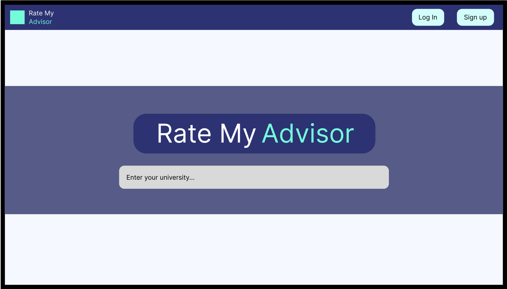

# Wireframes

Reference the Creating an Entity Relationship Diagram final project guide in the course portal for more information about how to complete this deliverable.

## List of Pages

- ⭐ Homepage with university search
- ⭐ University advisor listing with search, filter, and sort controls
- ⭐ Advisor profile with ratings and student reviews
- Review creation page
- Login and account registration page
- Advisor creation page (in progress)

Planned stretch page:

- Advisor comparison page

## Wireframe 1: Homepage

## Wireframe 2: University Advisors

## Wireframe 3: Advisor Profile

